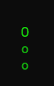
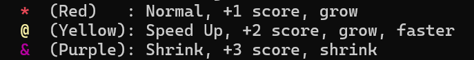
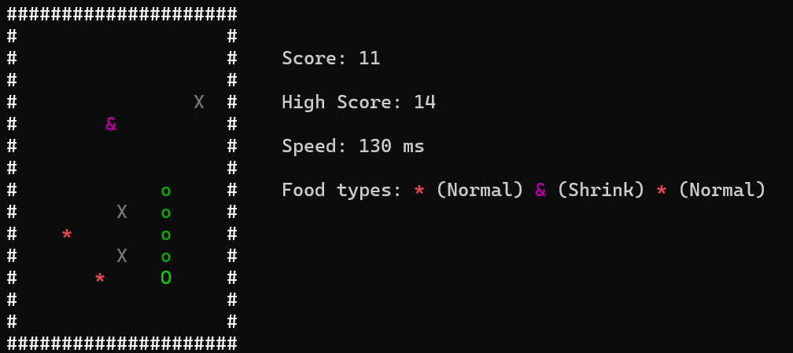

# 11328246 snake game 期末專案

## 目錄
[1. 遊戲簡介](#1遊戲簡介)  
[2. 遊戲內容說明](#2-遊戲內容說明)  
[3. 心得與改進](#3-心得與改進)

## 1. 遊戲簡介
這是一個簡單版的貪食蛇遊戲，玩家必須操控畫面中的蛇去吃到地圖上的果實，吃到不同種的果實會有不同的分數，並且系統能夠記錄自己的最高得分，另外記得注意突然出現的障礙物，撞到的話一樣會Game Over。

### 安裝與執行
1. 下載並解壓縮遊戲檔案。
2. 如果vscode無法執行，可試著使用`Code::Blocks 20.03`建立新專案以編譯及執行。

## 2. 遊戲內容說明
- 遊戲中的主角是一隻綠色的蛇，可以使用`W`、`A`、`S`、`D`來操控它移動。

  

- 會有三種的食物可以吃：  
  紅色`*`為一般食物，可以加1分。  
  黃色`@`為特殊食物，可以加2分，會加速和加長身體。  
  紫色`&`為特殊食物，可以加3分，會縮短身體。  

- 以下為實機遊玩畫面（`X`為障礙物）

- 如果觸碰到牆壁、障礙物或自己的尾巴，則視為Game Over。

## 3. 心得與改進
> 這個專案可以多增加一些難度選項，如會移動的障礙物，或是會減小的地圖，都可以讓遊戲更加豐富。並且可以試著使用SDL來開發更加生動的圖形化介面，雖然可能會更複雜一些，但是值得嘗試的選項。